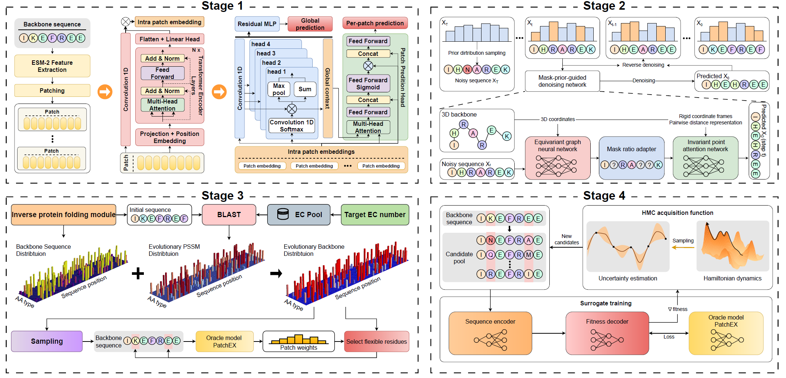

# PatchEX-Design 🧬

> An AI-powered computational pipeline combining inverse protein folding, evolutionary optimization, and directed evolution for enzyme engineering.

[](https://www.python.org/downloads/)
[](https://pytorch.org/)
[](https://opensource.org/licenses/MIT)


## 🌟 Overview

PatchEX-Design is a comprehensive computational pipeline for enzyme design and optimization. It integrates:

- **Inverse Protein Folding (IPF)**: Generate sequences from protein structures using diffusion models
- **Evolutionary Context**: Leverage PSI-BLAST to incorporate evolutionary information
- **Directed Evolution**: Optimize protein fitness through guided mutation strategies
- **Multi-Oracle Evaluation**: Assess designs using learned fitness models

### Key Features

- 🔬 Structure-guided sequence design with MapDiff
- 🧪 Evolutionary backbone sampling via PSI-BLAST
- 🎯 Target-driven optimization with configurable fitness oracles
- 📊 Comprehensive evaluation metrics (sequence recovery, TM-score, RMSD)
- ⚡ GPU-accelerated inference and optimization

## 🏗️ Architecture


## 📋 Requirements

### System Dependencies

- Python 3.9+
- CUDA 11.8+ (for GPU acceleration)
- BLAST+ 2.12+
- TMalign

### Python Dependencies

See `requirements.txt` for complete lists.

## 🚀 Installation

### Step 1: Setup environment

```bash
# Install BLAST
conda install -c bioconda blast

# Install TMalign
conda install -c bioconda tmalign -y

# Install dependencies
pip install -r requirements.txt

```

### Step 2: Download Model Weights

**⚠️ Important**: You must download the pre-trained model weights before running the pipeline.

```bash
# Download pipeline_weight.zip from Zenodo
wget https://mqoutlook-my.sharepoint.com/:u:/g/personal/ziqi_zhang_mq_edu_au/IQBYngpM7QrKRJTMFh4taBLmAVLxtMwKmptdS58XowSjqew?e=edeMdz

# Or manually download from: https://mqoutlook-my.sharepoint.com/:u:/g/personal/ziqi_zhang_mq_edu_au/IQBYngpM7QrKRJTMFh4taBLmAVLxtMwKmptdS58XowSjqew?e=edeMdz

# Unzip the file
unzip pipeline_weight.zip

# Move weights to correct directories
mv mapdiff_weight.pt MapDiff/
mv patchet_pretrain_weight ./
mv output ./
mv esm150 ./
```

**Expected directory structure after setup:**

```
EnzymeGPT/
├── MapDiff/
│   ├── mapdiff_weight.pt          ← MapDiff model weights
│   └── ...
├── patchet_pretrain_weight/        ← PatchET pretrained weights
│   └── ...
├── output/                         ← PatchEX weigths
│   └── ...
├── esm150/                         ← ESM model weights
│   └── ...
├── pipeline.py
├── optimization.py
└── ...
```

## Data download

```bash
https://mqoutlook-my.sharepoint.com/:u:/g/personal/ziqi_zhang_mq_edu_au/IQAdbWrW6YYzQYjAmyLOosN3ARGzJEaS4D2Up0oarf2frWI?e=dNSTQ2
```

## 💻 Usage

### Basic Usage

```bash
python pipeline.py --config pipeline_configs/config_temperature.yaml\
    --pdb  example/Q96552.pdb\
    --ec_pool example/2.5.1.6.fasta\
    --target_value 37.0
```


## 📊 Output

The pipeline generates the following outputs in `PipelineResults/{accession}/`:

```
PipelineResults/Q96552/
├── logits.pt                         # IPF model predictions
├── egnn_feats.pt                     # Structural features
├── pred.txt                          # IPF Predicted vs true sequences
├── evolutionary_backbone_logits.npy  # Logits from evolutionary sampling
├── seq_info.json                     # Evolutionary Sequence metadata
├── results.xlsx                      # Optimization trajectory
├── result.json                       # Final optimized sequence and metrics
└── log_default.txt                   # Detailed logs
```

### Output Metrics

- **Fitness**: Oracle-predicted fitness value
- **Sequence Recovery**: Identity to wild-type sequence
- **TM-score**: Structural similarity (if structure available)
- **RMSD**: Root mean square deviation
- **Selected Residues**: Positions chosen for mutation


---

**Star ⭐ this repo if you find it useful!**